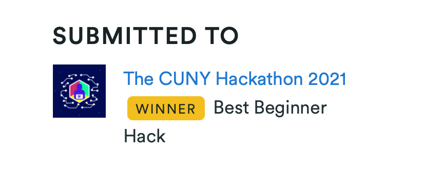
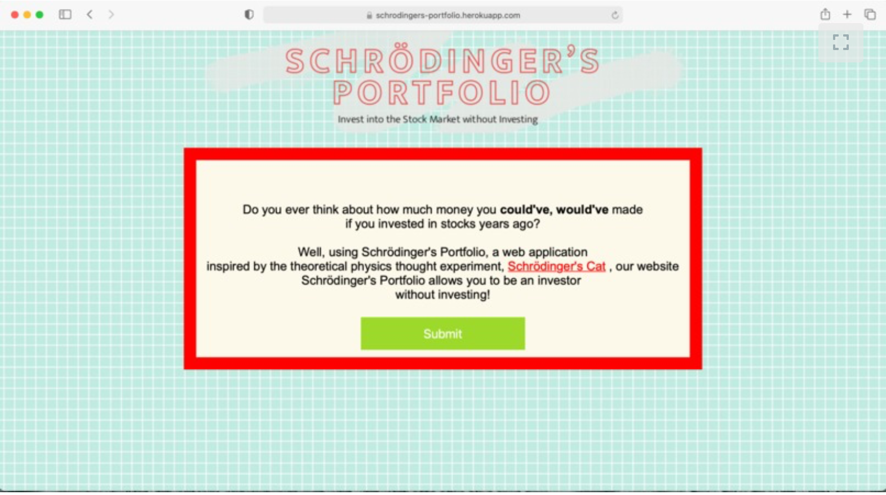
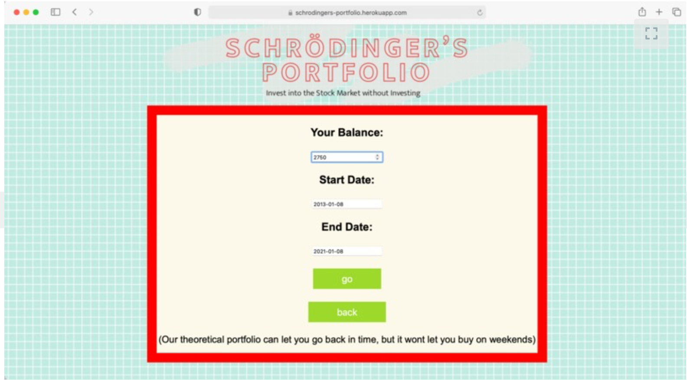
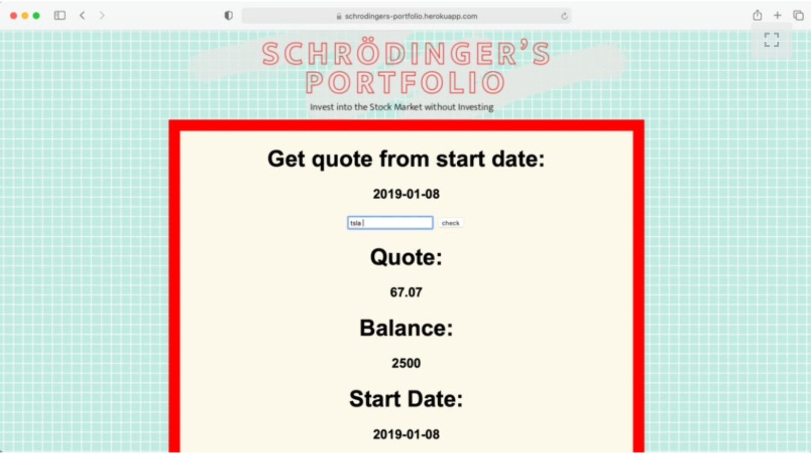
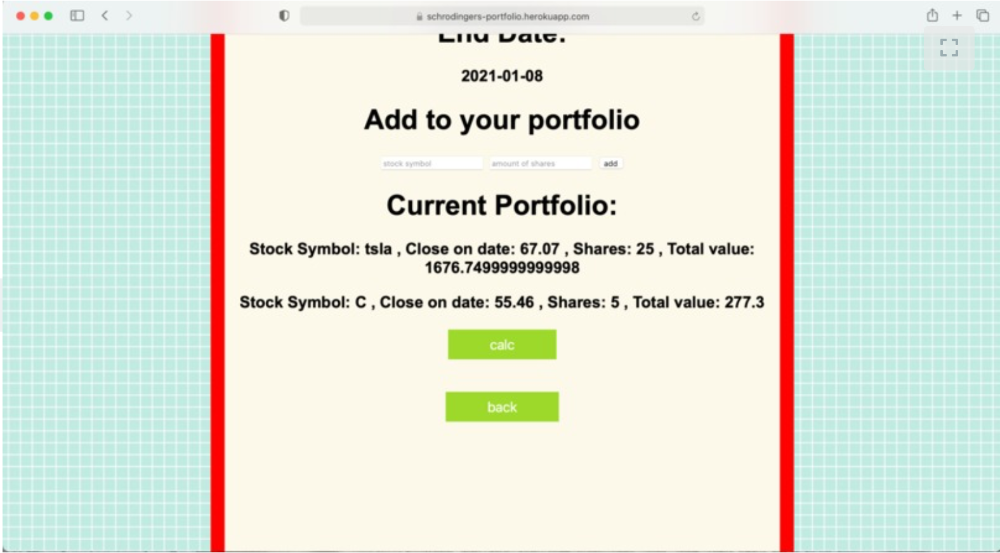
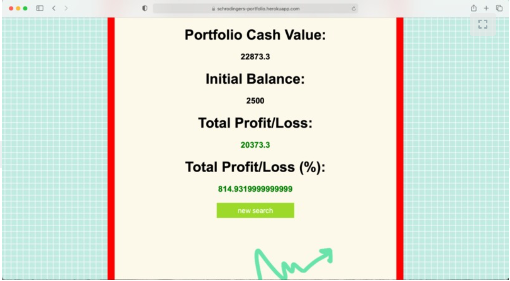

# Schrodinger's Portfolio

* This is our project for the CUNY HACKATHON. 
* Called "Schrodinger's Portfolio". 
* It is a web application that hooks up to the IEX cloud API and allows users to see if their hypothetical stock portfolio has earned or lost money over a given period of time.

